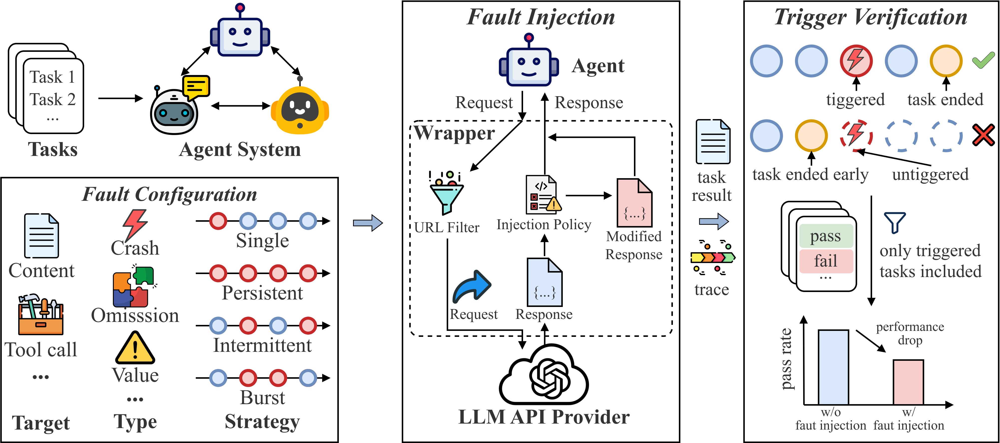
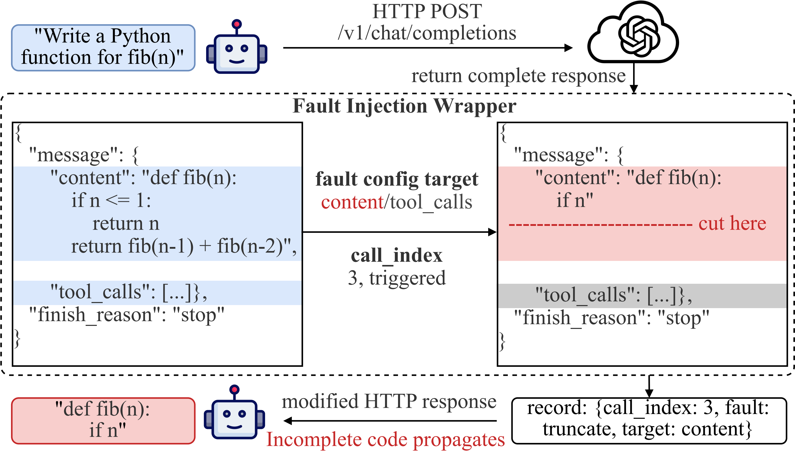

<h1 align="center">AgentChaos</h1>

<h3 align="center">Chaos Engineering for Agent Systems via Programmatic Fault Injection</h3>

<p align="center">
  
  
  
</p>

---

**AgentChaos** is a chaos engineering framework that evaluates the robustness of LLM-based agent systems through **controlled, runtime, non-intrusive fault injection** at the LLM API layer.

All agent systems access LLMs through the same HTTP interface. AgentChaos exploits this shared layer by installing a fault injection wrapper on the HTTP client at runtime — **no source code modification required**.

* 🎯 **Non-Intrusive** — Injects faults at the HTTP transport layer; works with any agent system without code changes
* 🔬 **Systematic** — 65 fault configurations derived from a principled taxonomy covering crash, omission, and value faults
* ⚡ **Runtime** — Faults are injected into live running systems, capturing real dynamic behaviors (retries, early termination, error propagation)
* 📊 **Reproducible** — Deterministic modification functions with configurable injection strategies and trigger verification

---

## Overview

LLM APIs in production can return server errors, truncated responses, or corrupted content. When an agent system issues multiple LLM API calls per task, any such fault can propagate through downstream agents and cause task failure.

**AgentChaos** addresses this by:

1. **Defining a fault taxonomy** adapted from classical distributed systems fault classification, covering 6 fault types × 2 target fields × 4 injection strategies + position and compound experiments = **65 fault configurations**.
2. **Injecting faults at the HTTP layer** by patching the HTTP client at runtime, intercepting and modifying LLM API responses according to the configured policy.
3. **Verifying trigger status** by checking execution traces after task completion and filtering untriggered tasks from evaluation.

<p align="center">
  
</p>

<p align="center">
  
</p>

---

## Fault Taxonomy

We enumerate all fault types by applying each classical fault category to each LLM API response field.

| Category   | Fault Type | Content | Tool Call | Real-World Scenario                                        |
| :--------- | :--------- | :-----: | :-------: | :--------------------------------------------------------- |
| **Crash**  | Error      |    ✓    |     ✓     | Server overload, HTTP 5xx, rate limiting                   |
|            | Timeout    |    ✓    |     ✓     | Network congestion, backend delay, API latency             |
| **Omission** | Empty    |    ✓    |     ✓     | Safety filter, content policy rejection                    |
|            | Truncate   |    ✓    |     ✓     | Token limit, TCP interruption, incomplete completion       |
| **Value**  | Corrupt    |    ✓    |     ✓     | Encoding error, garbled characters                         |
|            | Schema     |    ✓    |     ✓     | Parsing error, schema mismatch                             |

### Injection Strategies

| Strategy       | Description                                                              |
| :------------- | :----------------------------------------------------------------------- |
| **Single**     | Inject once at the first matching LLM call, then stop                    |
| **Persistent** | Inject at every matching LLM call throughout the entire task             |
| **Intermittent** | Inject at each matching call independently with probability 0.3        |
| **Burst**      | Inject at the first 3 consecutive matching calls, then stop             |

### Compound Scenarios

| Scenario         | Description                                              |
| :--------------- | :------------------------------------------------------- |
| API degradation  | Delay then return error response                         |
| Content filter   | Remove tool calls and replace content with filter message |
| Max tokens       | Truncate content and set `finish_reason` to `length`     |
| Proxy HTML       | Replace content with an HTML error page                  |
| Stale cache      | Replay previous response on the next call                |
| Stale data       | Replace tool call arguments with wrong values            |
| Wrong entity     | Replace tool call arguments with ambiguous values        |
| Slow response    | Add delay with no content change                         |

---

## Installation

- Python 3.12
- [uv](https://github.com/astral-sh/uv) (recommended) or pip

### Steps

```bash
# Clone the repository
git clone https://github.com/YOUR_USERNAME/AgentChaos.git
cd AgentChaos

# Install dependencies with uv
uv sync

# Or with pip
pip install -e .
```

### Configuration

Create `scripts/.env` with your LLM API credentials:

```bash
MODEL_PROVIDER="openai"
OPENAI_MODEL="gpt-4o"
OPENAI_BASE_URL="https://api.openai.com/v1"
OPENAI_API_KEY="sk-..."
```

---

## Quick Start

### 1. Prepare Dataset

```bash
cd scripts

# Prepare a single dataset
python prepare_dataset.py --dataset_name HumanEval

# Prepare all supported datasets
for ds in MATH MMLU-Pro HumanEval "HumanEval+" MBPP "MBPP+"; do
    python prepare_dataset.py --dataset_name "$ds"
done
```

### 2. Run Agent Systems (Without Fault Injection)

```bash
cd scripts
python run_all_method_dataset.py \
    --methods autogen mad mapcoder evomac \
    --datasets HumanEval MBPP MATH MMLU-Pro
```

### 3. Run with Fault Injection

```bash
cd scripts
python run_all_method_dataset.py \
    --methods autogen mad mapcoder evomac \
    --datasets HumanEval MBPP MATH MMLU-Pro \
    --fault_inject
```

### 4. Evaluate Results

```bash
cd scripts

# Run evaluation
python run_all_eval.py --workers 50

# Extract raw results into CSV
python all_extract.py --force
```

### 5. Generate Figures and Tables

```bash
cd scripts

# RQ1: Overall robustness
python all_RQ1.py

# RQ2: Fault configuration impact
python all_RQ2.py

# RQ3: Fault diagnosis
python all_RQ3.py
```

---

## Supported Agent Systems

All systems are reimplemented on [Google ADK](https://github.com/google/adk-python) with unified tool interfaces, preserving each system's original interaction logic.

| System                            | Pattern                       | Agents | Tools | Script               |
| :-------------------------------- | :---------------------------- | :----: | :---: | :------------------- |
| [AutoGen](https://arxiv.org/abs/2308.08155) | Conversation           | 2      | 2     | `run_autogen.py`     |
| [MAD](https://arxiv.org/abs/2305.19118)     | Multi-agent debate     | 4      | 2     | `run_mad.py`         |
| [MapCoder](https://arxiv.org/abs/2405.11403) | Multi-stage pipeline  | 5      | 1     | `run_mapcoder.py`    |
| [EvoMAC](https://arxiv.org/abs/2310.19964)   | Evolutionary decomposition | 4 | 1     | `run_evomac.py`      |
| [Mini-SE](https://arxiv.org/abs/2310.06770)  | Single-agent with tools | 1   | 4     | `run_mini_se.py`     |